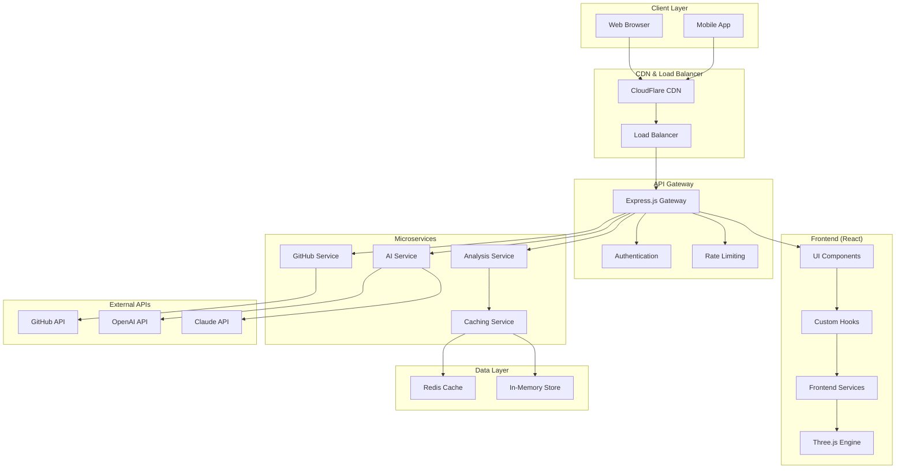
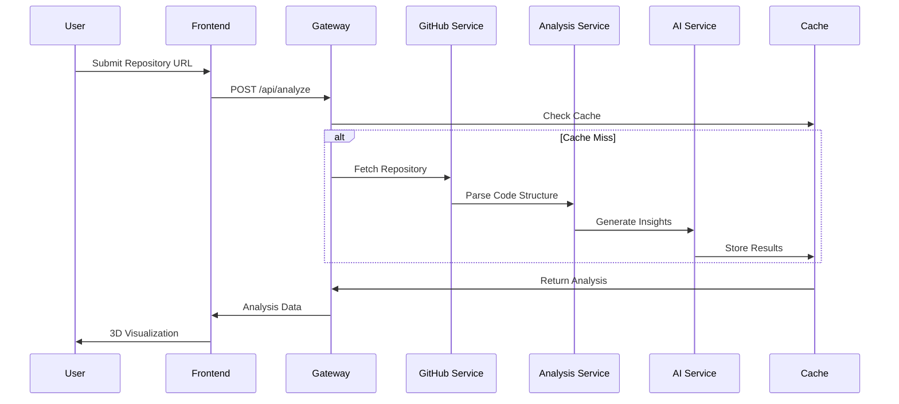

# 🏗️ AI Code Visualizer - System Architecture

## Table of Contents

- [Overview](#overview)
- [System Architecture](#system-architecture)
- [Frontend Architecture](#frontend-architecture)
- [Backend Architecture](#backend-architecture)
- [Data Flow](#data-flow)
- [API Design](#api-design)
- [Database Schema](#database-schema)
- [Security Architecture](#security-architecture)
- [Performance Optimization](#performance-optimization)
- [Scalability Considerations](#scalability-considerations)
- [Monitoring & Observability](#monitoring--observability)
- [Deployment Architecture](#deployment-architecture)

## Overview

The AI Code Visualizer is a full-stack application that transforms code repositories into interactive 3D visualizations using AI-powered analysis. The system follows a microservices-inspired architecture with clear separation of concerns, enabling scalability and maintainability.

### Core Principles

- **Modular Design**: Loosely coupled components with well-defined interfaces
- **Performance First**: Optimized for real-time 3D rendering and large codebases
- **AI-Driven Insights**: Leverages machine learning for intelligent code analysis
- **Scalable Architecture**: Designed to handle repositories of varying sizes
- **Security by Design**: Multiple layers of security throughout the stack

## System Architecture



## Frontend Architecture

### Component Hierarchy

```
App.jsx
├── Navbar.jsx
├── AICodeVisualizer.jsx
    ├── RepositoryInput.jsx
    ├── ThreeScene.jsx
    ├── AnalysisPanel.jsx
    ├── InsightsPanel.jsx
    ├── FileExplorer.jsx
    ├── CodeMetrics.jsx
    └── LoadingSpinner.jsx
```

### State Management Pattern

The application uses a **Custom Hooks + Context** pattern for state management:

```javascript
// Global State Architecture
AppContext
├── RepositoryContext
├── AnalysisContext
├── VisualizationContext
└── UIContext

// Custom Hooks Layer
useRepositoryAnalysis()
├── useGitHubAPI()
├── useAIInsights()
├── useThreeScene()
└── useCodeParser()
```

### Data Flow Pattern

1. **Repository Input** → Validation → GitHub API Call
2. **Raw Repository Data** → Code Analysis Service → Structured Data
3. **Structured Data** → AI Analysis → Insights & Metrics
4. **Processed Data** → Three.js Transformation → 3D Visualization
5. **User Interactions** → State Updates → Re-rendering

### Three.js Architecture

```javascript
// 3D Scene Hierarchy
Scene
├── Camera (Perspective)
├── Lighting
│   ├── AmbientLight
│   ├── DirectionalLight
│   └── PointLight
├── FileNodes
│   ├── Geometry (based on file type)
│   ├── Material (color-coded)
│   └── Metadata
├── Connections
│   ├── LineGeometry
│   └── Flow Animation
└── Controls
    ├── OrbitControls
    └── InteractionHandler
```

## Backend Architecture

### Service Layer Pattern

```
API Gateway (Express.js)
├── Authentication Middleware
├── Rate Limiting Middleware
├── Request Validation
├── Route Handlers
└── Error Handling

Service Layer
├── GitHub Service
│   ├── Repository Fetching
│   ├── File Content Analysis
│   └── Metadata Extraction
├── AI Service
│   ├── OpenAI Integration
│   ├── Claude Integration
│   └── Prompt Engineering
├── Analysis Service
│   ├── Code Parsing
│   ├── Dependency Mapping
│   ├── Complexity Analysis
│   └── Metrics Calculation
└── Caching Service
    ├── Redis Operations
    ├── Memory Management
    └── Cache Invalidation
```

### API Layer Structure

```javascript
// Controller Pattern
controllers/
├── analysisController.js
│   ├── analyzeRepository()
│   ├── getAnalysisStatus()
│   └── getAnalysisResults()
├── githubController.js
│   ├── fetchRepository()
│   ├── getFileContent()
│   └── validateRepository()
└── aiController.js
    ├── generateInsights()
    ├── analyzeCodeQuality()
    └── suggestImprovements()
```

### Middleware Stack

```javascript
// Express.js Middleware Chain
app.use(helmet())              // Security headers
app.use(cors())                // CORS configuration
app.use(compression())         // Response compression
app.use(rateLimiter)          // Rate limiting
app.use(authMiddleware)       // Authentication
app.use(validateRequest)      // Request validation
app.use(errorHandler)         // Error handling
```

## Data Flow

### Repository Analysis Pipeline



### Real-time Data Updates

```javascript
// WebSocket Architecture for Live Updates
WebSocket Connection
├── Analysis Progress Updates
├── Real-time Metrics
├── Collaborative Features
└── Error Notifications

// Event-Driven Updates
EventEmitter
├── 'analysis:started'
├── 'analysis:progress'
├── 'analysis:completed'
├── 'analysis:error'
└── 'cache:updated'
```

## API Design

### RESTful API Structure

```
POST   /api/v1/analyze              # Start repository analysis
GET    /api/v1/analyze/:id          # Get analysis status
GET    /api/v1/analyze/:id/results  # Get analysis results
GET    /api/v1/repository/:owner/:repo  # Get repository info
POST   /api/v1/ai/insights          # Generate AI insights
GET    /api/v1/metrics/:id          # Get code metrics
DELETE /api/v1/cache/:id            # Clear analysis cache
```

### Request/Response Schemas

```javascript
// Analysis Request
{
  "repositoryUrl": "string",
  "branch": "string",
  "options": {
    "includeTests": "boolean",
    "maxFileSize": "number",
    "aiAnalysis": "boolean"
  }
}

// Analysis Response
{
  "id": "string",
  "status": "pending|processing|completed|error",
  "progress": "number",
  "results": {
    "structure": "object",
    "metrics": "object",
    "insights": "object",
    "visualization": "object"
  },
  "metadata": {
    "createdAt": "string",
    "processingTime": "number",
    "cacheHit": "boolean"
  }
}
```

## Database Schema

### Cache Data Structure (Redis)

```javascript
// Repository Analysis Cache
{
  "repo:{owner}:{name}:{branch}": {
    "structure": "object",    // File tree structure
    "metrics": "object",      // Code metrics
    "insights": "object",     // AI insights
    "dependencies": "array",  // Dependency graph
    "ttl": "timestamp"       // Time to live
  }
}

// User Session Cache
{
  "session:{id}": {
    "userId": "string",
    "analyses": "array",
    "preferences": "object",
    "ttl": "timestamp"
  }
}
```

### In-Memory Data Structure

```javascript
// Active Analysis Store
{
  "analysisId": {
    "status": "string",
    "progress": "number",
    "startTime": "timestamp",
    "workerId": "string",
    "results": "object"
  }
}
```

## Security Architecture

### Authentication & Authorization

```javascript
// JWT-based Authentication
{
  "iss": "ai-code-visualizer",
  "sub": "user-id",
  "iat": "timestamp",
  "exp": "timestamp",
  "scope": ["read:repo", "analyze:code"]
}

// Role-based Access Control
{
  "roles": ["user", "premium", "admin"],
  "permissions": {
    "analyze": ["public-repos", "private-repos"],
    "ai-insights": ["basic", "advanced"],
    "export": ["json", "pdf", "svg"]
  }
}
```

### Security Measures

- **Input Validation**: Schema validation for all API inputs
- **Rate Limiting**: Per-user and per-IP rate limits
- **CORS Configuration**: Strict origin policies
- **Security Headers**: Helmet.js security headers
- **API Key Management**: Secure storage of external API keys
- **Audit Logging**: Comprehensive request/response logging

## Performance Optimization

### Frontend Optimizations

```javascript
// Code Splitting
const AICodeVisualizer = lazy(() => import('./components/AICodeVisualizer'));
const ThreeScene = lazy(() => import('./components/ThreeScene'));

// Memoization
const MemoizedFileNode = React.memo(FileNode);
const memoizedCalculation = useMemo(() => heavyCalculation(data), [data]);

// Virtual Rendering for Large Trees
const VirtualizedFileTree = ({ items }) => {
  return (
    <FixedSizeList
      height={600}
      itemCount={items.length}
      itemSize={35}
    >
      {FileTreeItem}
    </FixedSizeList>
  );
};
```

### Backend Optimizations

```javascript
// Caching Strategy
const cacheMiddleware = (ttl = 300) => {
  return async (req, res, next) => {
    const key = generateCacheKey(req);
    const cached = await redis.get(key);
    
    if (cached) {
      return res.json(JSON.parse(cached));
    }
    
    res.sendResponse = res.json;
    res.json = (data) => {
      redis.setex(key, ttl, JSON.stringify(data));
      res.sendResponse(data);
    };
    
    next();
  };
};

// Database Connection Pooling
const pool = new Pool({
  host: process.env.REDIS_HOST,
  port: process.env.REDIS_PORT,
  max: 20,
  idleTimeoutMillis: 30000
});
```

### 3D Rendering Optimizations

```javascript
// Level of Detail (LOD)
const LODMesh = new THREE.LOD();
LODMesh.addLevel(highDetailMesh, 0);
LODMesh.addLevel(mediumDetailMesh, 100);
LODMesh.addLevel(lowDetailMesh, 500);

// Frustum Culling
const frustum = new THREE.Frustum();
const cameraMatrix = camera.projectionMatrix.clone()
  .multiply(camera.matrixWorldInverse);
frustum.setFromProjectionMatrix(cameraMatrix);

// Instanced Rendering for Similar Objects
const instancedMesh = new THREE.InstancedMesh(
  geometry, 
  material, 
  instanceCount
);
```

## Scalability Considerations

### Horizontal Scaling

```javascript
// Load Balancer Configuration
const cluster = require('cluster');
const numCPUs = require('os').cpus().length;

if (cluster.isMaster) {
  for (let i = 0; i < numCPUs; i++) {
    cluster.fork();
  }
} else {
  require('./server');
}

// Microservice Architecture
services/
├── analysis-service/     # Scalable analysis workers
├── github-service/       # GitHub API abstraction
├── ai-service/          # AI processing workers
└── cache-service/       # Distributed caching
```

### Vertical Scaling

```javascript
// Memory Management
const memoryMonitor = {
  checkMemoryUsage: () => {
    const usage = process.memoryUsage();
    if (usage.heapUsed > MEMORY_THRESHOLD) {
      gc(); // Force garbage collection
      clearOldCache();
    }
  }
};

// CPU Optimization
const worker = require('worker_threads');
const analysisWorker = new worker.Worker('./analysis-worker.js');
```

## Monitoring & Observability

### Logging Strategy

```javascript
// Structured Logging
const logger = winston.createLogger({
  level: 'info',
  format: winston.format.combine(
    winston.format.timestamp(),
    winston.format.errors({ stack: true }),
    winston.format.json()
  ),
  transports: [
    new winston.transports.File({ filename: 'error.log', level: 'error' }),
    new winston.transports.File({ filename: 'combined.log' })
  ]
});

// Performance Metrics
const metrics = {
  analysisTime: new Histogram('analysis_duration_seconds'),
  apiRequests: new Counter('api_requests_total'),
  cacheHitRate: new Gauge('cache_hit_rate'),
  activeUsers: new Gauge('active_users')
};
```

### Health Checks

```javascript
// Health Check Endpoints
GET /health              # Basic health check
GET /health/detailed     # Detailed system status
GET /metrics            # Prometheus metrics

// Health Check Implementation
const healthCheck = {
  redis: () => redis.ping(),
  memory: () => process.memoryUsage().heapUsed < MAX_MEMORY,
  cpu: () => os.loadavg()[0] < CPU_THRESHOLD,
  externalAPIs: () => Promise.all([
    checkGitHubAPI(),
    checkOpenAI(),
    checkClaude()
  ])
};
```

## Deployment Architecture

### Container Strategy

```dockerfile
# Multi-stage Docker Build
FROM node:18-alpine AS builder
WORKDIR /app
COPY package*.json ./
RUN npm ci --only=production

FROM node:18-alpine AS runtime
WORKDIR /app
COPY --from=builder /app/node_modules ./node_modules
COPY . .
EXPOSE 3000
CMD ["node", "server.js"]
```

### Infrastructure as Code

```yaml
# docker-compose.yml
version: '3.8'
services:
  app:
    build: .
    ports:
      - "3000:3000"
    environment:
      - NODE_ENV=production
      - REDIS_URL=redis://redis:6379
    depends_on:
      - redis
    
  redis:
    image: redis:7-alpine
    ports:
      - "6379:6379"
    volumes:
      - redis_data:/data
    
  nginx:
    image: nginx:alpine
    ports:
      - "80:80"
      - "443:443"
    volumes:
      - ./nginx.conf:/etc/nginx/nginx.conf
    depends_on:
      - app

volumes:
  redis_data:
```

### CI/CD Pipeline

```yaml
# .github/workflows/cd.yml
name: Deploy
on:
  push:
    branches: [main]

jobs:
  deploy:
    runs-on: ubuntu-latest
    steps:
      - uses: actions/checkout@v3
      - name: Build Docker Image
        run: docker build -t ai-code-visualizer .
      - name: Deploy to Production
        run: |
          docker-compose down
          docker-compose up -d
      - name: Health Check
        run: curl --fail http://localhost/health
```

### Environment Configuration

```javascript
// Environment-specific configurations
const config = {
  development: {
    redis: { host: 'localhost', port: 6379 },
    logging: { level: 'debug' },
    cache: { ttl: 300 }
  },
  production: {
    redis: { url: process.env.REDIS_URL },
    logging: { level: 'info' },
    cache: { ttl: 3600 }
  }
};
```

---

## Architecture Decisions

### Technology Choices

1. **React**: Component-based architecture, excellent ecosystem
2. **Three.js**: Mature 3D rendering library with good performance
3. **Express.js**: Lightweight, flexible Node.js framework
4. **Redis**: High-performance caching and session storage
5. **Docker**: Containerization for consistent deployments

### Design Patterns

1. **Component Composition**: Over inheritance for React components
2. **Custom Hooks**: For reusable stateful logic
3. **Service Layer**: Separation of business logic from controllers
4. **Repository Pattern**: Data access abstraction
5. **Observer Pattern**: For real-time updates and events

### Trade-offs

1. **Performance vs Features**: Prioritized real-time 3D rendering over advanced AI features
2. **Complexity vs Maintainability**: Chose modular architecture over monolithic simplicity
3. **Memory vs Speed**: Used aggressive caching at the cost of memory usage
4. **Cost vs Capabilities**: Limited AI API calls to control operational costs

This architecture is designed to be robust, scalable, and maintainable while providing an exceptional user experience for code visualization and analysis.